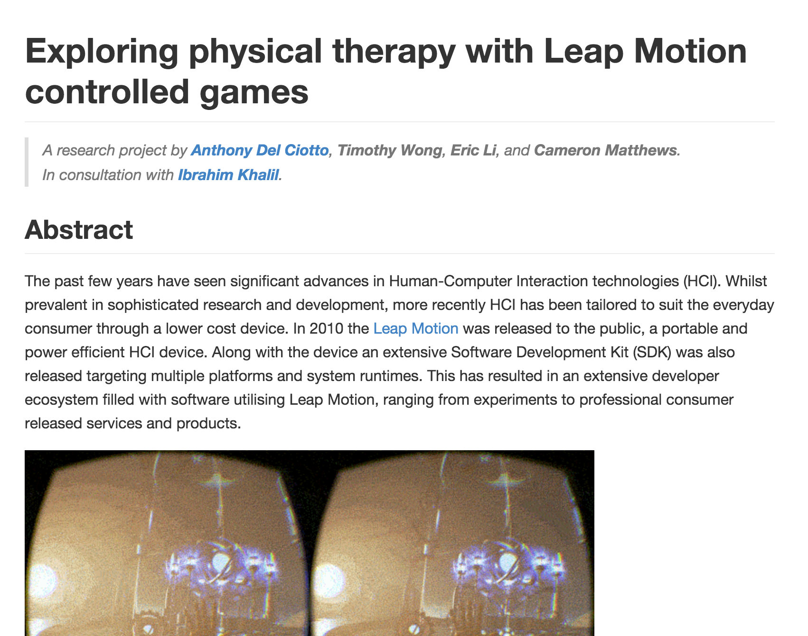

## leapmotion-report

This repository contains a the markdown documents for the final research report for COSC2048 (Exploring physical therapy
with Leap Motion controlled games)

### Contributing:

This report uses Github flavoured markdown, so please adhere to the style guides outlined
[here](https://github.com/adam-p/markdown-here/wiki/Markdown-Cheatsheet)

**Note:** If you want to preview the rendered markdown, then please use [this](http://tmpvar.com/markdown.html) or any
similar Github flavoured markdown renderer.

### Preview:

Final report will look like this:

