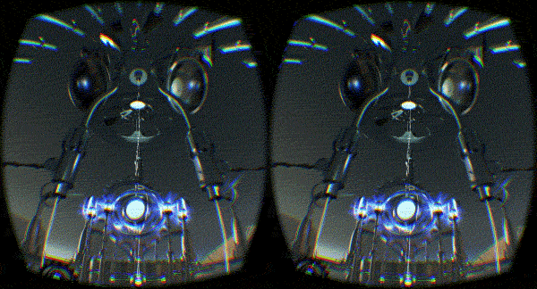
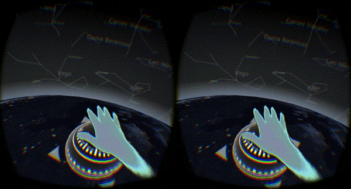

# Exploring physical therapy with Leap Motion controlled games

> *A research project by **[Anthony Del Ciotto](http://anthonydel.com)**, **Timothy Wong***.* 
  *In consultation with **[Ibrahim Khalil](http://goanna.cs.rmit.edu.au/~ibrahimk/)**.*

## Abstract

The past few years have seen significant advances in Human-Computer Interaction technologies (HCI). Whilst prevalent in
sophisticated research and development, more recently HCI has been tailored to suit the everyday consumer through a
lower cost device. In 2010 the [Leap Motion](https://www.leapmotion.com/) was released to the public, a portable and
power efficient HCI device. Along with the device an extensive Software Development Kit (SDK) was also released targeting
multiple platforms and system runtimes. This has resulted in an extensive developer ecosystem filled with software
utilising Leap Motion, ranging from experiments to professional consumer released services and products.

*[Carillon](https://developer.leapmotion.com/gallery/carillon) An interactive musical performance environment*

*[Planetartium](https://developer.leapmotion.com/gallery/carillon) Explore the night sky with Planetarium*

This project creates physical therapy software in the form of interactive games using the Leap Motion controller for
input. Focusing on the rehabilitation of children and young adolescents suffering from hand injuries and impairment, our
experimental software aims to deliver a form of therapy which is both effective and enjoyable for the patient. We have
devised a number of interactive games as part of the program which prototype conducting specific therapy through fun
exercises. The program is built with the latest web technologies that allow it to run both natively and within multiple
web browsers on multiple platforms.

## Introduction

Our goal is to develop one or more casual interactive video games; utilising Leap Motion technologies to improve the
physical therapy experience for patients. Our aim is to give children the incentives to effectively complete their
therapy through enjoyment and stimulation which ultimately provides their doctors accurate information regarding their
progress.

At the outset we identified the following issues for resolution:

  * How to map physical therapy exercises to simple game mechanics.
  * Ensuring that these mechanics are actually effective in performing a therapeutic exercise.
  * Keeping the games entertaining after multiple iterations of performing the same physical exercise.
  * Giving the patient incentive to fully complete their exercises.
  * Designing an intuitive user experience for both the patients and medical staff.
