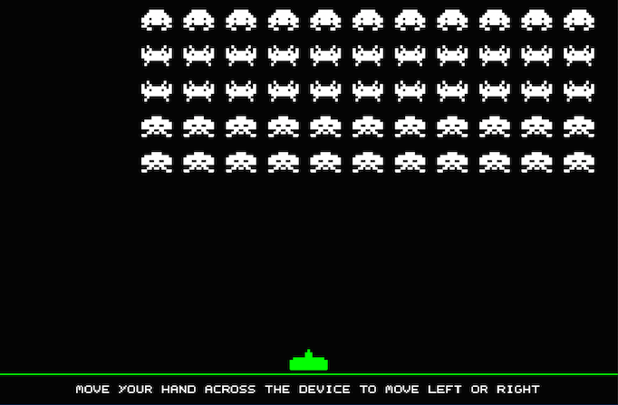
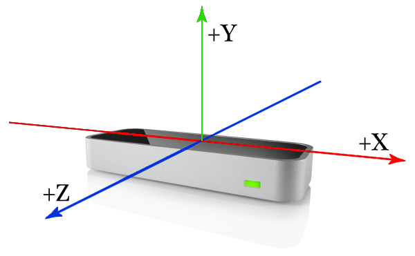
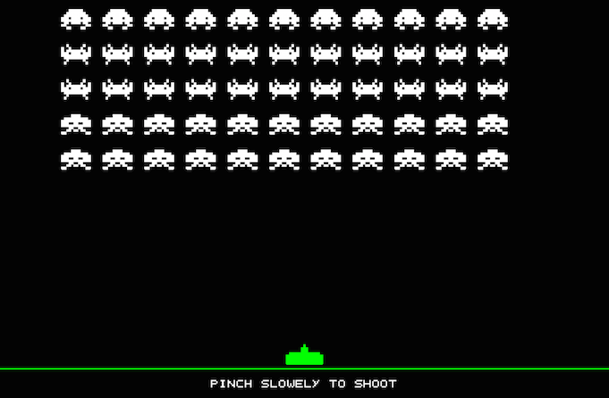
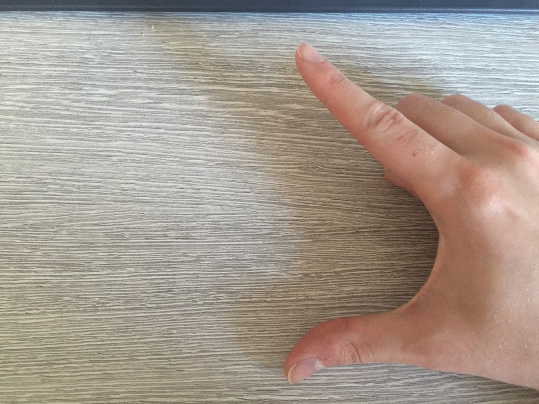
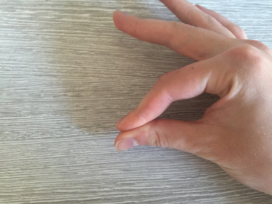
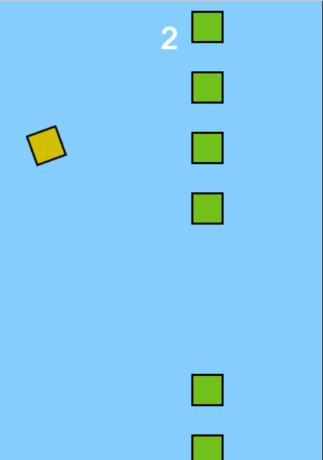
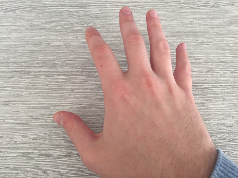
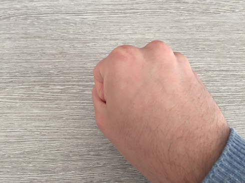

## Methodology

### Description of experiments

One of the predominant goals of these experiments is to integrate physical therapy exercises into interactive games that
actually:

  > * Provide a substitute for regular hand / finger therapeutic exercises. </br>
  > * Keep the user entertained; providing a real gaming experience.

To achieve this, three interactive prototypes have been developed that reproduce popular classic action games. Cloning
popular titles allowed us to lighten the work load, immediately providing a solid game play foundation to attempt to
integrate motion controls into. Furthermore increasing the possibility of helping ease users into this non-conventional
play style with familiar game mechanics they would recognise from their own gaming experiences or portrayal in popular
media. To keep the barrier for entry low, we have developed the games using modern web technologies, so that they can be
easily accessible and playable via a modern web browser (Chrome, Safari, Firefox, etc).

Due to the prototypal nature of the experiments, many ideas, designs and implementations needed to be constantly tweaked
or discarded upon user testing. This meant that it was essential to be able to quickly edit, and get new prototypes up
and running. To achieve this efficient workflow, a template project was developed that uses a suite of [Node.js]()
modules that automate building, hosting (both locally and remotely), live editing, and asset optimisation. The template
project is included in the submission under the folder *leapmotion-prototype-template*, and can also be accessed via
it's Github repository at: https://github.com/adelciotto/leapmotion-prototype-template

*Note: All linked Github repositories are private, access can be granted upon request to Anthony Del Ciotto*

### Leap Motion abstraction

To speed up the process of adding and editing Leap Motion gestures, we have developed a small and simple abstraction
that is common to all the experiments. It is located in the *leap/* folder in each experiments *src/* directory. We use
this abstraction by first adding the custom event we want to support to the ```LeapListeners``` object literal defined in
*leap/leap_listeners.js*:

```js
const LeapListeners = {
    OnMove: {
        name: 'OnMove',
        defaultOpts: { axis: LeapUtils.Axis.ALL }
    },
    OnRotate: {
        name: 'OnRotate',
        defaultOpts: { rotAngle: LeapUtils.RotAngles.ROLL }
    },
    OnPinching: {
        name: 'OnPinching'
    },
    ...
}
```

*Figure 1.0: Adding custom listeners to LeapListeners*

As illustrated in *Figure 1.0*, some events have a ```defaultOps``` property. This allows us to define options for each
type of event. For example, the ```OnMove``` event can define an ```axis``` option which specifies the axis to return of
the ```palmPosition``` vector.

```js
this._controller = new Leap.LeapController(this.game);
this._controller.on(Leap.LeapListeners.OnMove, this._handleOnMove, this);
...

_handleOnMove(palmPosition, hand) {
    // do some logic here
    ...
}
```

*Figure 1.1: Creating a LeapController and assigning an event handler to the ```OnMove``` event*

In the initialisation of each game, a ```LeapController``` is created, and listeners are added for each event the
specific game wants to support. The callback function will be supplied any relevent data via parameters, so that more
application logic can be performed. The actual processing for these events is internally implemented in the ```LeapController```.

```js
// initialise leapjs API and listen to the 'frame' event
this._controller = new Leap.Controller();
this._controller.connect();
this._controller.on('frame', this._onFrame.bind(this));

_onFrame(frame) {
    ...

    _.each(this._listeners, (val, key) => {
        this[`_process${key}`](frame, hand, val);
    });
}

_processOnMove(frame, hand, listener) {
    const opts = listener.options;
    const pos = (opts.axis === LeapUtils.Axis.ALL ? hand.stabilizedPalmPosition :
            hand.stabilizedPalmPosition[opts.axis]);

    listener.callback(pos, hand);
}
...
```

*Figure 1.2: ```LeapController``` using the Leap Motion API and actually performing the logic to recognise the events*

*Note: There is much more logic present in the ```LeapController```. The source is located at leap/leap_controller.js.*

### Experiment 1: Space Invaders

**Source can be found in *leapmotion-space-invaders* and viewed online at:
https://github.com/adelciotto/leapmotion-space-invaders**

The first experiment is a clone of the famous arcade shooter [Space Invaders]() developed by [Taito]() in 1978. In this
reproduction, the core game play and mechanics have not been altered much from the original. Leap Motion controls have
been implemented into the moving and shooting mechanics. The user moves their palm across the device horizontally to
move the spaceship, and slowly pinches any four of their fingers to their thumb to shoot lasers. This pinching gesture
is a common therapeutic exercise for broken or fractured fingers, or stroke rehabilitation.



*Figure 1.3: The player moves their palm horizontally across the Leap Motion to position the player ship*

As stated above and by the in-game help text in *Figure 1.3*, the player simply moves their hand across the Leap Motion
horizontally to position the player ship. This equates to measuring their palms distance in millimetres from the origin
of the device on the x-axis. The coordinate system is depicted in the illustration in *Figure 1.4* below.



*Figure 1.4: Leap Motion coordinate system*

Getting the distance from the origin is trivial and actually handled by the Leap Motion API through the
```palmPosition``` property of the ```Hand``` class. This property is a 3 dimensional vector containing the distance in
millimetres from the origin for each axis (X, Y, and Z). We wrap this functionality in the ```OnMove``` event, and the
processing involved for this can be seen in *Figure 1.2*.



*Figure 1.5: Leap Motion coordinate system*

Leap Motion also natively includes recognition for a pinching gesture between any four fingers and the thumb. It is
accessiible via the ```pinchStrength``` property of the ```Hand``` class, and is a floating point number in the range of
0..1 that represents the strength of the pinch hand pose. This functionality is wrapped in both the ```OnPinching``` and
```OnPinched``` events, with the former event being constantly invoked as the user is pinching, while the latter
is invoked only once each pinch. To ensure that the user is exercising more than just one finger, the game will only let
the player shoot if a different finger has pinched since the last stored pinch. Leap Motion does not provide which
finger is currently pinching, so some simple extra functionality was required by us to determine the currently pinching
finger in the form of the utility function ```findPinchingFinger(hand)``` (located in *leap/leap_utils.js*).

```js
findPinchingFinger(hand) {
    let pincher;
    let closest = 500;

    for (var f = 1; f < 5; ++f) {
        const curr = hand.fingers[f];
        const distance = Leap.vec3.distance(hand.thumb.tipPosition, curr.tipPosition);
        if (curr !== hand.thumb && distance < closest) {
            closest = distance;
            pincher = curr;
        }
    }

    return pincher;
}
```

*Figure 1.6: ```findPinchingFinger(hand)``` utility function*

This function determines the currently pinching finger by simply iterating over each one calculating the distance between
it's tip and the tip of the thumb, storing the current smallest distance, and the finger associated with that distance.





*Figure 1.7: Pinching gesture*

### Experiment 2: Flappy Bird

**Source can be found in *leapmotion-flappybird* and viewed online at:
https://github.com/adelciotto/leapmotion-flappybird**

For the next prototype, we decided to clone the more modern mobile game [Flappy Bird](), released on both Apple's
App Store and Google's Play Store in May 2013. This game was a commercial hit, with extremely simple and yet addictive
game play. Our version has the player perform a clenching gesture to fly the bird higher, as opposed to tapping the
screen. Initially we restricted the player from continiously being able to clench their hand in an attempt to emulate
the original frantic tapping on the screen by having them constantly clench and un-clench. However after extensive play
testing this resulted in a sore hand after only small game sessions. This means the mechanics have slightly changed from
the original adopting the control scheme of the similar game [iCopter](https://itunes.apple.com/au/app/icopter-classic/id301409454?mt=8).
The user now has to hold their clench to continiously raise the Y-Velocity of the bird, un-clenching will allow the
gravitational force to pull the bird down.



*Figure 1.7: In-game screen-shot of the Flappy Bird clone*

Similairly to the pinching gesture, Leap Motion represents clenching through the ```gripStrength``` property of the
```Hand``` class. We wrap this in the ```OnClenching``` event, and the logic for processing this event is similar to
that of ```OnPinching```.

```js
_processOnClenching(frame, hand, listener) {
    const strength = hand.grabStrength;
    if (strength >= this._options.minGrabStrength) {
        listener.callback(strength, hand);
    }
}
```

*Figure 1.8: Processing function for the clenching event*





*Figure 1.9: Clenching gesture*

### Experiment 3: Wolfenstein 3D

**Source can be found in *leapmotion-wolfenstein-3d* and viewed online at:
https://github.com/adelciotto/leapmotion-wolfenstein-3d**

### Data preparation

TODO: Discuss original transition from stroke rehibilitation to hand therapy; discuss anecdotal experiences (alysha)

TODO: List and discuss some references

### Programs and scripts required

TODO: Discuss all prod and dev tools needed
