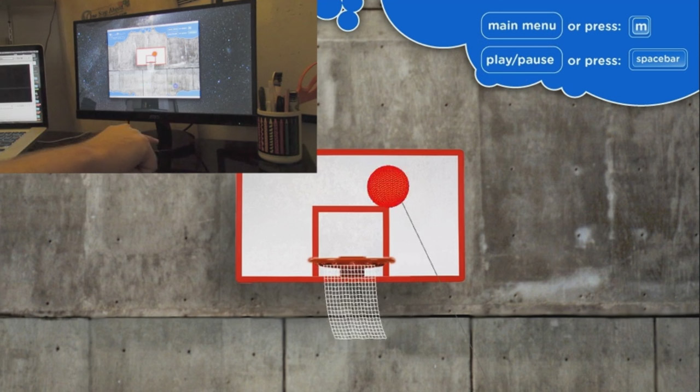
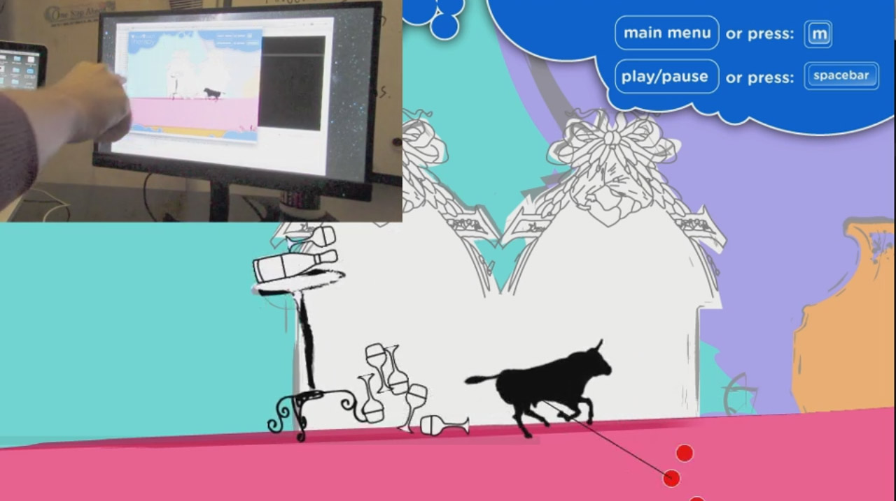

## Related work

During our preliminary research, we discovered a number of projects utilising the Leap Motion for similar purposes. Most
notably
[Visual Touch Therapy (Vtt)](http://blog.leapmotion.com/axlr8r-spotlight-making-physical-therapy-fun-with-ten-ton-raygun/),
which concentrates specifically on the more extreme rehabilitation of adult stroke victims. The discovery of this
project caused us to shift our focus to a more simplistic adaptation to child physical hand therapy. From the research
gathered from Vtt and other similar projects, we have realised that the very complex full body exercises required for
adult therapies demand more accuracy and flexibility than the Leap Motion can deliver to us in such a short development
time frame. In summary these discoveries aided us in defining our scope and focus for the project.

***Vtt in action***

