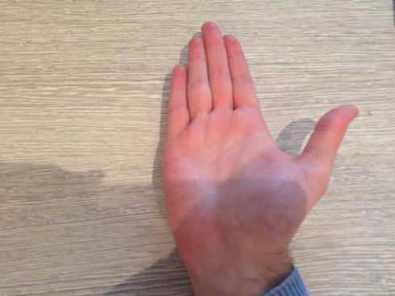
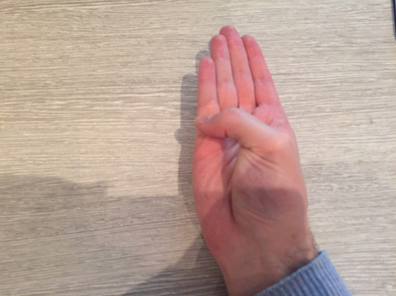

## Results

Due to time constraints and the limited scope of the project, user testing with real patients was not a possibility.
However despite this, we have demonstrated that it is certainly possible to map and implement therapeutic hand and finger
exercises into entertaining games using Leap Motion. Equipped with a larger scope, more time and consolidation with
medical staff and patients, a counterpart for traditional physical therapy is absolutely possible with this technology.

### Flappy Bird

With a simpler game mechanic, Flappy Bird turned out to be the more enjoyable of the experiments. The clenching
exercise was trivial to implement and maps to the core game play mechanic extremely well, making for tight, responsive and
entertaining game play. The mechanics require that the fist be clenched and unclenched frequently, but not to the point
of strain or injury. This ensures the hand gets adequate exercise, potentially making it effective for actual therapy.

### Space Invaders

Space Invaders pinching mechanic proved more complex than initially estimated. In the original arcade game, the user
cannot hold down the shoot button to achieve rapid fire, there is either a delay, or a shot is fired just once as the
button is held down (depending upon the implementation). Adding a delay between shots made the game play frustrating, as
it was easy to mistake the failure to shoot as the Leap Motion not recognising the gesture. In play testing we found
that during this delay enforced by the game we would often keep rapidly pinching trying to shoot and end up wasting the
next shot instead of carefully aiming it to hit an alien. To counteract this we went with the former approach some of the
original versions of Space Invaders took. We defined an ```onPinched``` event, which only invokes the callback once even
if the pinch is held down. Once the user releases the pinching finger they will be able to pinch and shoot again. This
improved the problem as during game play we knew there wasen't some arbitrary delay and could always predict and
carefully time our shots.

### Wolfenstein 3D

Wolfenstein proved more challenging to map therapeutic exercises too. The final result is an extremely engaging
experience, albeit fairly complicated for a novice gamer. This is the only experiment of the three that combines two
physical exercise gestures. The contracting and stretching of the thumb to attack, and the clenching of the first to open
doors and push walls. The combination of these gestures and keyboard controls increases the learning curve quite
drastically from the other experiments, however this prototype has proved somewhat succesfull in providing a more
*hardcore* experience. For the attack gesture we also tried another physical exercise, the thumb flex. However it was
difficult to perform while aiming, and caused muscle strain fairly quickly.





*Figure 2.3: Thumb flex gesture*
